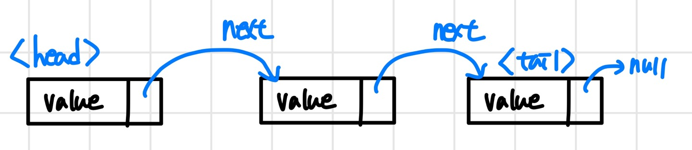

# 선형자료 구조

<aside> 💡 : **선형 자료 구조**(Linear data structure)은 연속적으로 데이터가 나열되는/ 요소가 일렬로 나열되어있는 자료구조 입니다.

**대표적인 선형 자료 구조 :** array, dynamic-array, list, linked-list, vector, stack, queue, hash table
</aside>

[TOC]

## 1. Array

: Data를 메모리 상에 ==미리 할당된 크기==만큼 ==연속적이며 순차적==으로 데이터를 저장하는 자료구조

- **특징**

  - 고정된 저장 공간(fixed-size)으로 ==컴파일(Compile) 단계==에서 메모리를 할당하는 정적(Static) 자료구조 → Stack 영역 할당됨
  - 데이터의 연속성을 유지하기 위해 <mark>순차적인<mark/> 데이터 저장(order)→ 연속된 메모리 공간에 데이터 저장
  - 데이터 각각은 연속적으로 되어 있어 각각 순차적인 인덱스를 가짐

- **장점**

  - append(요소 끝에 데이터 추가)가 O(1)로 빠르다.
  - 인덱스로 무작위 random 접근이 가능하여 access 접근성이 좋다. O(n)

- **단점**

  - 저장공간이 fix 되어 있기 때문에 선언시에 데이터 크기를 알고 있어야 한다.

    → 메모리 낭비나 추가적인 overhead 발생

- **시간 복잡도**

  

**<면접 기출>**

1. Data 가 많아 Array size를 초과하면 어떻게 해결할 수 있나?

   1. “Dynamic Array” 활용

   기존 size 보다 더 큰 array를 선언하여 데이터를 옮겨서 할당합니다. 모든 data를 옮기고 기존 array는 삭제합니다. 이런식으로 동적으로 배열의 크기를 조절하는 자료구조를 “Dynamic Array”라고 합니다.

   1. “Linked-list” 활용

   데이터 size를 예측할 수 없다면 array 대신 linked-list를 사용하여 데이터가 추가될 때 마다 메모리 공간을 할당 받는 방식을 사용하여 메모리를 효율적으로 관리하는 방법이 있습니다.

### 1-2. Dynamic Array

: Static Array의 한계점인 fixed-size를 해결한 array로 dynamic array는 저장 공간이 가득차면 **resize** 과정을 통해 유동적으로 배열의 size를 조절하여 데이터를 저장하는 자료구조 ex) vector

***Resize 방법**

- **Doubling**: 기존 array size 의 2배가 되는 크기를 가지는 배열 생성

  : data를 append(O(1))하다가 메모리 초과 시 2배 크기의 array를 선언하고 데이터를 일일이 옮김(O(n))

  → 그렇다면 dynamic array의 append 시간 복잡도는 O(n)인가?

  : append의 과정은 대부분 데이터를 마지막 인덱스에 추가하는 O(1) 작업이 대다수이고, resize(O(n))은 가끔 발생합니다. 따라서 전체적인 평균 비용은 **O(1)**이라고 할 수 있습니다.

## 2. Linked-list

: linked-list는 **node**(Data+next node의 adress)라는 구조체로 구성된 **Dynamic (동적 )자료구조** 입니다.

- **특징**

  - 물리적인 메모리 상에서 비 연속적으로 저장되지만 각각의 node가 next node의 adress를 가리킴으로써 논리적인 연속성을 가진 자료구조라고 할 수 있습니다.
  - tree, graph 등의 자료구조 구현에 사용됩니다.

- **장점**

  - 데이터가 추과되는 시점에 메모리를 할당(동적 할당)하기 때문에 메모리의 효율적 사용이 가능합니다.

    →runtime 단계에서 node를 추가 했을 때만 메모리를 할당하기 때문에 heap 메모리에 할당

- **단점**

  - next node를 가리키는 pointer 때문에 메모리 사용량이 늘어납니다.(array는 데이터마다 4byte 소모 but linked-list는 데이터마다 value+adress로 8byte 소모)
  - 순차적 접근 방식을 사용하기 때문에 랜덤접근(random access)가 불가능 합니다. 만약 데이터에 접근하려면 첫번째 head node 부터 탐색해야합니다 O(n).

- **시간 복잡도**

  

- **linked-list 종류**

  **1) 싱글 연결 리스트:** next pointer 만 가짐

  

  **2) 이중 연결 리스트:** next, prev pointer를 가짐

  

  **3) 원형 이중 연결 리스트:** 마지막 노드의 next pointer가 head를 가리킴

  

## 3. Array vs Linked-list

1. **메모리 저장에서의 차이**

- Array는 메모리 상에서 연속적이고 순차적으로 데이터를 저장하는 자료구조
- Linked-list는 메모리 상에서 비 연속적으로 저장되지만 포인터로 각 노드를 연결하여 논리적 연속성을 유지한 자료구조

2. **각 operation의 시간 복잡도 차이**

