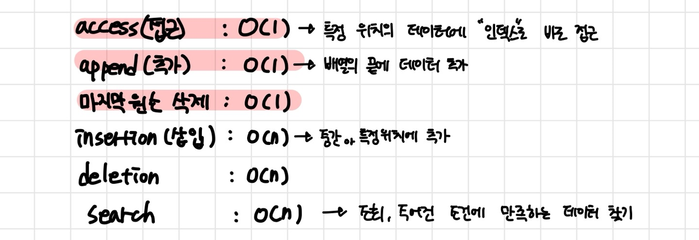

<aside> 💡 : **선형 자료 구조**(Linear data structure)은 연속적으로 데이터가 나열되는/ 요소가 일렬로 나열되어있는 자료구조 입니다.
**대표적인 선형 자료 구조 :** array, dynamic-array, list, linked-list, vector, stack, queue, hash table
</aside>

## 1. Array

: Data를 메모리 상에 미리 할당된 크기만큼 연속적이며 순차적으로 데이터를 저장하는 자료구조

- 특징

  - 고정된 저장 공간(fixed-size)으로 컴파일(Compile) 단계에서 메모리를 할당하는 정적(Static) 자료구조 → Stack 영역 할당됨
  - 데이터의 연속성을 유지하기 위해 순차적인 데이터 저장(order)→ 연속된 메모리 공간에 데이터 저장
  - 데이터 각각은 연속적으로 되어 있어 각각 순차적인 인덱스를 가짐

- 장점

  - append(요소 끝에 데이터 추가)가 O(1)로 빠르다.
  - 인덱스로 무작위 random 접근이 가능하여 access 접근성이 좋다. O(n)

- 단점

  - 저장공간이 fix 되어 있기 때문에 선언시에 데이터 크기를 알고 있어야 한다.

    → 메모리 낭비나 추가적인 overhead 발생

- 시간 복잡도

  

  