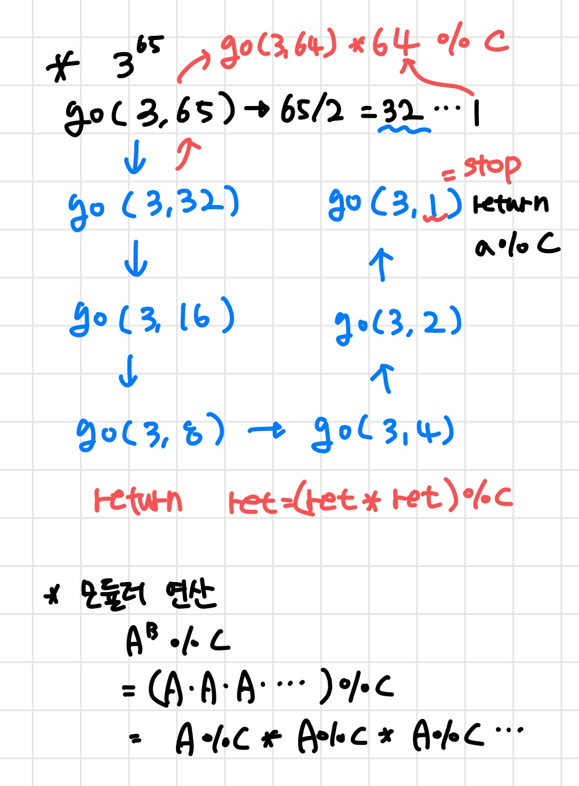

# 1629__곱셈_

##### 난이도 🔴🔴

- 모듈러 연산과 재귀 함수가 포인트



```cpp
#include <bits/stdc++.h>
using namespace std;
typedef long long ll;

ll a,b,c;

ll go(ll a, ll b){
	if(b==1) return a%c; // 기저 사례  
	
	ll ret = go(a,b/2);
	ret= (ret*ret) %c;
	
	if(b %2) ret = (ret*a) %c; // 마지막에 b가 홀수라면  
	return ret; 
	
}

int main(){
	cin >> a >> b >>c;
	cout << go(a,b) << "\\n";
	
	return 0;
}
```