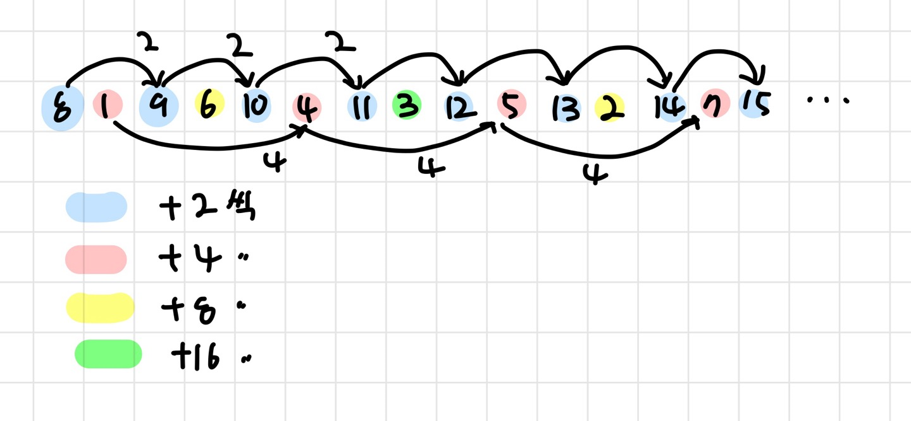
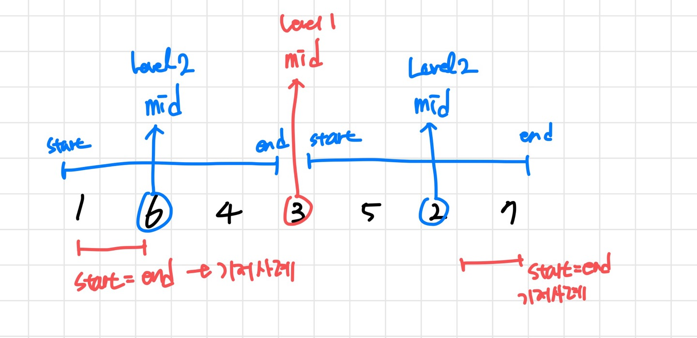

##### 난이도 🔴

```cpp
//내가 푼 방식
#include <bits/stdc++.h>
using namespace std;
int n,a,depth;
vector<int> v;
vector<int> ret[1050];
int visited[1050];

void go(int depth){
	int a=0;
	while(visited[a]) a+=1;

	int start=a;
		
	for(int i=0; i<=(1<<n)-1 ; i += (1 << depth)){
		ret[depth].push_back(v[start+i]);
		//cout <<  " 방문 노드: " << v[start+i] << "\\n"; 
		visited[start+i]=1;
	}
	
}

int main(){
	cin >> n;
	for(int i=0; i<(1<<n)-1; i++){
		cin >>a;
		v.push_back(a);
	}

	for(int i=1; i<n+1 ;i++){
		go(i);
	}
	
	for(int i=n; i!= 0; i--){
		for(int a: ret[i]){
			cout << a << " ";
			
		}cout << "\\n";
	}
	
	return 0;
}
```



```cpp
//답안 방식
#include <bits/stdc++.h>
using namespace std; 
vector<int> ret[14];
int n, a[1030];
void go(int s, int e, int level){ 
    if(s > e) return; 
    if(s == e){ 
        ret[level].push_back(a[s]); 
        return;
    }
    int mid = (s + e) / 2;
    ret[level].push_back(a[mid]);
    go(s, mid - 1, level + 1); 
    go(mid + 1, e, level + 1); 
    return;
}
int main(){
    cin >> n;
    int _end = (int)pow(2, n) - 1; 
    for(int i = 0; i < _end; i++){
        cin >> a[i]; 
    }
    go(0, _end, 1); // start, end, depth
    for(int i = 1; i <= n; i++){
        for(int j : ret[i]){
            cout << j << " ";
        }
        cout << "\\n";
    }
    return 0;
}
// 3
// 1, 5
// 0, 2, 4, 6
```


