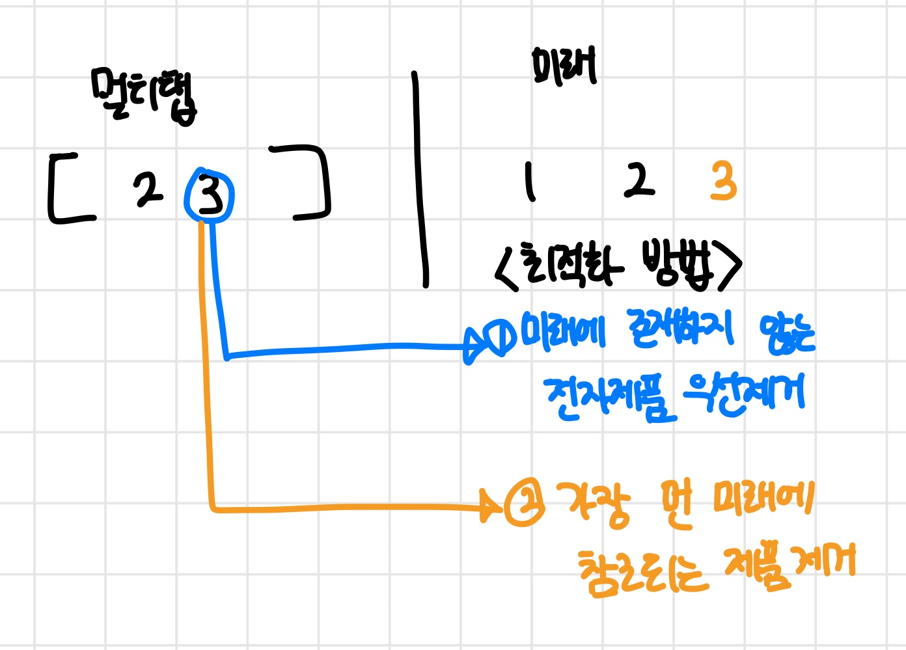

##### 난이도 🔴🔴🔴

```cpp
#include <iostream>
#include <vector> 
#include <algorithm>
using namespace std;
int k,n,a[104], multi[104],cnt;
const int INF=987654321;
vector<int> v; //멀티탭에 들어있는 코드들  

int main(){
	cin >> k >> n;
	for(int i=0; i<n; i++) cin >> a[i]; // 미래 예측 장치  
	
	for(int i=0; i<n; i++){ // 전자용품 사용 순서대로  
		if(!multi[a[i]]){ // 멀티탭에 꽂혀있으면 통과 아니면 if문  
		  
			if(v.size()==k){ // 멀티탭이 꽉 찼다면  
				// 최적화  
				int last_idx=0; // 가장 먼 미래 참조되는 인덱스  
				int pos;
				for(int _a:v){ //멀티탭에 들어있는 코드들  
					int here_pick=INF;
					for(int j=i+1; j<n; j++){ // 가장 먼 미래에 참조될 친구 확인  
						if(_a==a[j]){
							here_pick =j;
							break;
						}
					}
					if(last_idx < here_pick){ // 가장 먼 미래에 참조되는 제품 선택  
						last_idx = here_pick;
						pos=_a; // 스위칭 할 코드  
					}
				} 
				multi[pos]=0; // 멀티탭에서 뽑기  
				cnt++;
				v.erase(find(v.begin(),v.end(), pos)); // 멀티탭에서 뽑기  
			} 
			// 멀티탭이 안 차 있다면 계속 push 
			v.push_back(a[i]);
			multi[a[i]]=1; // 멀티탭 꽂았음을 표시  
		}
	}	
	
	cout << cnt << "\\n";
	return 0;
}
```

