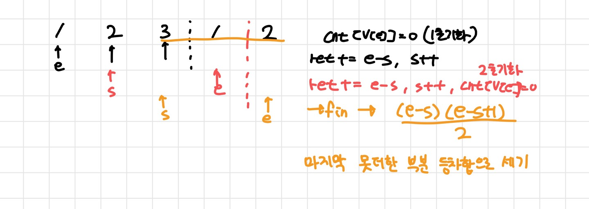

##### 난이도 🔴🔴🔴

```cpp
//시간 초과  
#include <iostream>
#include <vector>
#include <string.h>

using namespace std;
int n,s,e,a,ret;
int cnt[100004];
vector<int> v;

int main(){
	cin >> n;
	for(int i=0; i< n; i++){
		cin >> a;
		v.push_back(a);
	}
	
	for(int s=0; s<n; s++){
		for(int e=s; e<n; e++){
			if(cnt[v[e]]==1) {
				//cout << ret << "\\n";
				memset(cnt,0,sizeof(cnt));
				break;
			} 
			//cout << "S: " << s << " , " << v[e] << "\\n";
			cnt[v[e]]=1;
			ret++;
			if(e==n-1){
				memset(cnt,0,sizeof(cnt));
			}
		}
	}
		
		
	
		
	cout << ret;
	return 0;
}

```

```c++
// 정답 코드
#include <iostream>
#include <vector>
#include <string.h>

using namespace std;
long long n,s,e,a,ret;
int cnt[100004];
vector<int> v;

int main(){
	cin >> n;
	for(int i=0; i< n; i++){
		cin >> a;
		v.push_back(a);
	}
	
	while(e<n){
		if(!cnt[v[e]]){ // 중복된 수가 아니라면 
			cnt[v[e]]=1;
			e++;			
		}else {
			ret += e-s;
			cnt[v[s]]=0;
			s++;
		}
		
	} 
	ret+= (long long) (e-s)*(e-s+1)/2 ; // 등차수열의 합 공식이 만들수 있는 조합 개수와 같음  
	cout << ret; 
}
```

